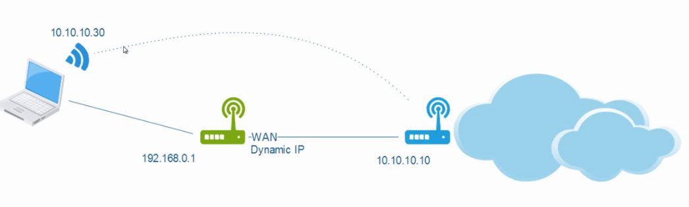
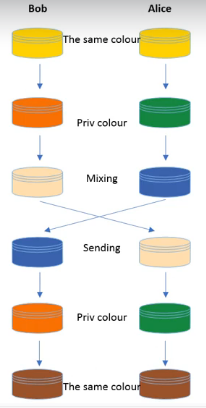

VPN
:vpn:

[5 cheap and good VPN services](https://proprivacy.com/vpn/comparison/best-cheap-vpn-service)
[CheatSheets, books and info](http://packetlife.net)

# Key Concepts
Site-to-site: to connect two offices.

Remote access: to connect your work network remotely.

Hashing: fixed-length value to ensure integrity.

Encryption: hiding information.
AES: advanced encryption standard.
Asymmetric: Public key + Private Key / Digital certification.

# VPN At Home
    1. Replace the router with an edge router with a built-in VPN server. Ex: Asus, Fritz, Zyxel, Sophos Cyberoam, Draytek, Synology RT2600ac (~$300 CAD) etc.
    2. Use NAS (network attached storage device) as your VPN server. This will work as a VPN behind your router (ex: synology).
    3. Flash your router with dd-wrt.
    4. Create a VM or a server with a VPN Server (ex: OpenVPN).

# Protect Your Network (with VPN)
Cyberghost - software that encrypts your traffic. Use it in a restaurant wifi on your laptop or phone. Caspersky also has one. Buy something on a sale. It shouldn't cost more than $2-$3 unless you need extra features.
VPN on the router will encrypt your network traffic. (NordVPN has a trial. But you can Google up a VPN).

# Router and OpenVPN
If you go to NordVPN, you will see the option for your router (ex: asus) and if possible, select OpenVPN.
Set up a kill switch, you cannot browse internet if the tunnel drops.

# How to Choose a VPN Provider
NordVPN, ExpressVPN

    1. Verify encryption and protocols (should be AES256, SHA256, it should say what they use for both encryption and hash), especially if they say "next generation encryption algorithm, protocols. MD5 is old, sha-1 also)
    2. Make sure there is NO logging
    3. Kill switch
    4. OpenVPN for all platforms (widely supported), as a first option
    5. Easy to use desktop application (using a trial you can test it)
    6. Fast and reliable (using a trial you can test it)

# Basic Commands
`ipconfig` (on windows)
`ping`

# Remote Access VPN
On the router.

    * PPTP - do NOT use it. Insecure. Just IP range (public IP) and User+Pass
    * L2TP + IPsec - secure.
    * SSL - the most popular. Clientless SSL connection, just using a browser.
    * OpenVPN (uses SSL) - needs a client.

# VPN using NAS
Install package called VPN server.
Forward some ports to the NAS device (listed on the router website. synology would say which ports need to be forwarded to be able to be used by synology services. then you go into your router and do port forwarding)

# OpenVPN on Router
    1. Router that supports OpenVPN will have the option to enable it.
    2. Then you create username and password.
    3. Download the porfile and use that on the client machine.
    4. Install OpenVPN client on the client machine and install the profile. By pasting the client file in the right folder on client PC machine.

# OpenVPN Using a VM
Google.

# Flashing a Router with DD-WRT
[DD-WRT website](DD-WRT.com) make sure you know about networking and linux. Select a compatible router when possible.
Using recovery mode is recommended.
Commands for installation are available on dd-wrt.com

# Lab Setup

Cheap Router: TP-Link Archer C1200 (~$50)
    Make sure it is VPN Pass-Through, with PPTP, L2TP, and IPSec
    Make sure it has VPN Server OpenVPN, PPTP, VPN
    Signal rate - the more the better, if you can get a gigabit..

# Configuring the Router
Device Password. Time Zone. Connection (dynamic or static or PPOE).
## PPTP
in PPTP use MS Chap version.

## OpenVPN
You will need to generate a cert. UDP (?)
Home network only - you browse internet through the main router, and connect to internal devices through the VPN router.
Internet and Home network - all traffic goes through the VPN.

# Dynamic DNS
Translating IP address into a human readable domain name. Dynamic IP changes all the time. Even if you know your public (external) IP, tomorrow it might change.

You can use a public service for dynamic IP address. Sometimes the router manufacturer provides a service like that.
Or another service like [NO-IP.com](NO-IP.com). After creating an account there, you will use the domain name they provide, and the user name and password, and you will add these 3 things into your router Dynamic DNS settings. After setting up the integration, the public IP address of the router will be updated in the NO-IP.com service.

# Port Forwarding
On TP-Link router port forwarding is called Virtual Servers.
VNC uses TCP protocol. If you are forwarding ports for a service, check what protocol that service uses.

# IP Sec - Theory
Internet Protocol Security is a framework of open standards developed to secure information exchange over the internet. Security framework. Allows to create a side-to-side VPN and a remote VPN.

AH (Authentication Header) - no encryption.
ESP (Encapsulating Security Payload) - the protocol we use for VPNs.
IKE (Internet Key Exchange) - IKEv1 and IKEv2 (latter is more secure and faster)
ISAKMP (Internet Security Association and Key Management Protocol) - negotiation and management

IPsec modes:
Transport (IP header remains intact, remote VPNs)
Tunnel (the entire original IP packet is protected S2S VPNs)

IKE Phase 1: devices authenticate each other, agree upon algorithms they will use. and set up a secure control chanel
IKE Phase 2: sometimes called IPsec. Tunnel used for actual traffic, SAs (Security Associations) are established.
PFS (Perfect Forward Secrecy): offers another Diffie-Hellman key calculation for IKE Phase 2 and periodic rekey procedure. More secure.

Diffie-Hellman Key Exchange: establishing a shared secret over an unsecure network.  
[Video Explainer:](https://www.youtube.com/watch?v=QPD3IgCUkVY)  

EC (Elliptic Curve) algorithm is more secure. Sometimes they just name them by Group number. Google it to see what it provides.

# IP Sec - Practical
Side to side

# Remote Tools
## Remote connection over internet
TeamViewer - there is a free version.

## Local Area Network
Radmin (faster)
VNC (also good) you will need to install a system service on one device and client (viewer) on another.
    RealVNC
    TightVNC

# SSL Using a Cisco ASA Firewall
MFA
SSL VPN in Cisco is very expensive.
