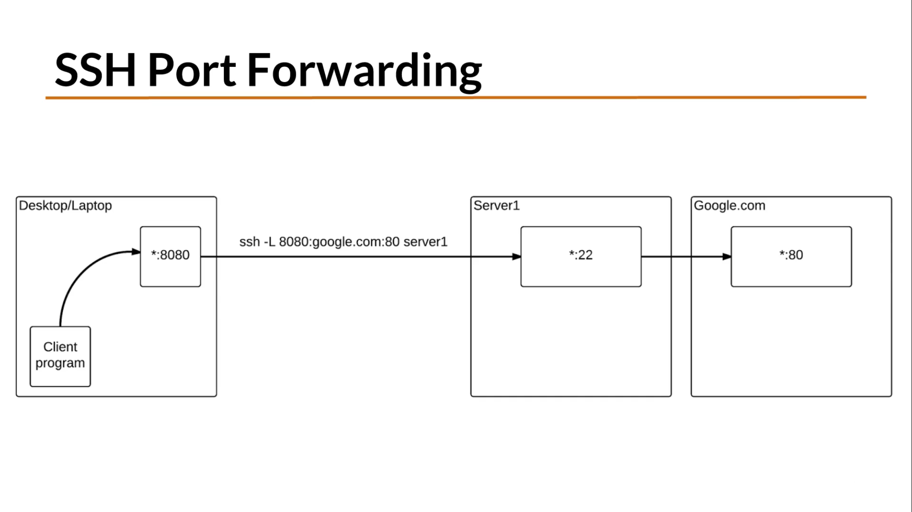
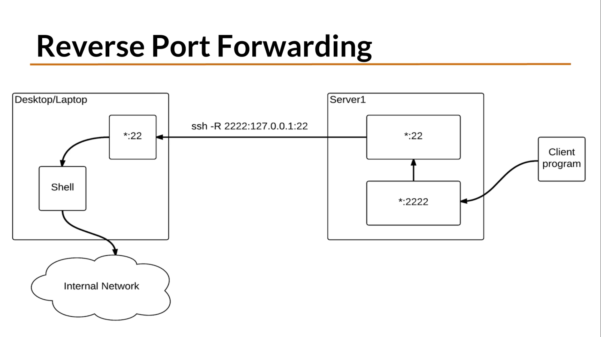
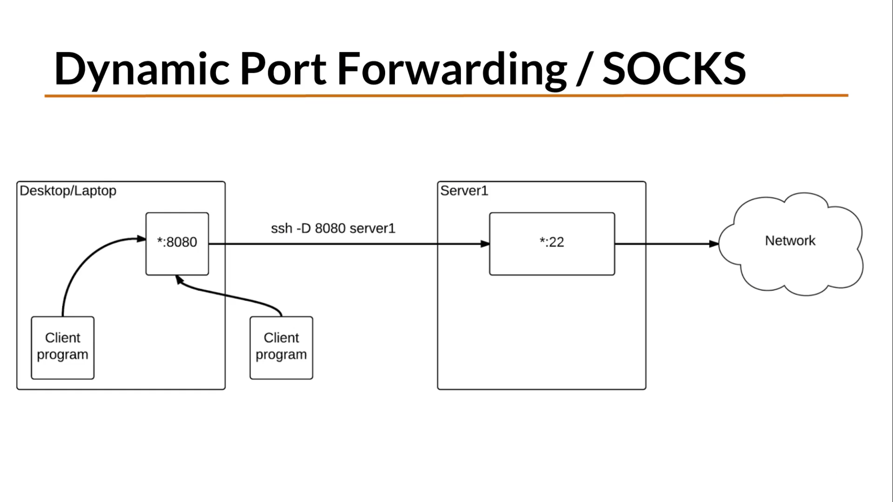

# Contents

- [SSH](#SSH)
    - [Resources](#SSH#Resources)
    - [Flags](#SSH#Flags)
    - [Pub/Priv Key Authentication](#SSH#Pub/Priv Key Authentication)
    - [SSH Hardening](#SSH#SSH Hardening)
- [SSH Tunnels](#SSH Tunnels)
    - [Connect to a remote service](#SSH Tunnels#Connect to a remote service)
    - [Hop from one machine to another](#SSH Tunnels#Hop from one machine to another)
- [Port Forwarding](#Port Forwarding)
    - [Images](#Port Forwarding#Images)
    - [Remote](#Port Forwarding#Remote)
    - [Local](#Port Forwarding#Local)
    - [Dynamic](#Port Forwarding#Dynamic)

# SSH
:ssh:

SSH is an OpenSSH client - ssh remote login program.

## Resources

    - [SSH Handshake](https://gravitational.com/blog/ssh-handshake-explained/)
    - **A beginner’s guide to SSH for remote connection on Linux** [Opensource.com](https://opensource.com/article/20/9/ssh)
    - [TLS Connection](https://tls.ulfheim.net)

## Flags

    * `-4` force IPv4 only
    * `-6` force IPv6 only
    * `-A` enable agent forwarding. Can also be specified in a config file per host.
    * `-a` disables forwarding of the authentication agent connection.
    * `-C` requests compression of all data (gzip). Slow on fast networks.
    * `-c` selects cipher specification for encrypting the session.
    * `-D [bind_address:]port` specifyies a local dynamic application level port forwarding. 
        * Allocates a socket to listen on port on the local side.
        * Can be optionally bound to a specified bind address.
        * when connection is made to this port, the connection is forwarded over the secure channel and the application protocol is then used to determine where to connect to from the remote machine.
    * `-F configfile` specify the config file per user
    * `-f` requests ssh to go to background just before command execution.
    * `-i identity_file` specifies an identity file (private key) for public key authentication
        * default is ~/.ssh/id_dsa, ~/.ssh/id_rsa etc.
        * you can have multiple `-i` defined
    * `-J destination` connect to target host by first making an ssh connection to the jumphost described by 'destination'
        * multiple jump hosts can be specified
        * ~/.ssh/config is used to specify configuration for jump hosts
    * `-L [bind_address:]port:host:hostport` specifies that connections to the given TCP port (or Unix socket, see other formats in man) on local (client) host, are to be forwarded to the given host and port on the remote side.
        * connection goes through a secure channel
        * can be specified in config file
    * `-l <user>` remote user
    * `-N` do not execute a remote command. Just for forwarding ports
    * `-n` redirects stdin from /dev/null
        * it prevents reading from stdin
        * for use with running session in background
        * ex: `ssh -n remote-host gui-app &` starts gui-app on remote-host and forwards X11 over secure shh tunnel. Note that it doesn't work on passworded login
    * `-p port` specify the port on the remote host you wish to connect to
    * `-R [bind_address:]port:host:hostport` specifies that connections to the given TCP port on the remote host are to be forwarded to the local side
        * when a connection is made to this port (or Unix socket), the connection is forwarded over secure channel. And a connection is made from the local machine to host:hostport
    * `-v` verbose mode
    * `-W host:port` requests that stdin and stdout on the clien be forwarded to host on port
    * `-X` enables X11 forwarding
    * `-Y` enables trusted X11 forwarding
    * ``
    * ``

You can issue remote commands through ssh without starting a shell:
    * `ssh user@host -- <command>`
    * `ssh user@remote-host "cat ~/.ssh/authorized_keys"`

`ssh root@<router-IP> -- "<command>" > <local-file>` execute command on remote (router) and capture results locally (zero config on remote)

`ssh root@<router-IP> tcpdump -U -s 65535 -w - 'not port 22' | wireshark -k -i -` execute command on remote and send output to another local command (here - output of tcpdump to local wireshark

execute commands on a remote host

`ssh username@myserver ps > /tmp/ps.out` run a command on the remote system and save the output locally
`ssh username@myserver ps \> /tmp/ps.out` same thing, but save on the remote system (backslash escapes `>` and passes it to remote shell to execute)

`ssh username@myserver bash < ./osdetect.sh > osdetect.out` execute local script on remote system and save results locally

best is to use `ssh-keygen` so you don't have to include passwords in your scripts

[File Transfer with SSH, Tee, and Base64 - Susam Pal](https://susam.in/blog/file-transfer-with-ssh-tee-and-base64/?mc_cid=3f16ae8bed&mc_eid=49c3ca7423)
## Pub/Priv Key Authentication

Public/Private key authentication is more secure than passwords.

`ssh-keygen -t ed25519 -C "tim@debian"` Generate private/public keys pair
    * `-t <algo>` define algo
        * `-t rsa -b 4096` on Mac you may not have as many algo options
    * `-C "user@client"` machine
    * always a good idea to add a password to your key, though if you do, it will ask you for the pass on login
    * public key will have .pub, private won't have an extension

Place the public key on the ssh server.
    * `cat ~/.ssh/id_lala.pub | ssh tim@remote-host "mkdir -p ~/.ssh && cat >> ~/.ssh/authorized_keys"` only if `ssh-copy-id` is not available
    * `ssh-copy-id user@remote-host` user on remote doesn't need to match to user on local

## SSH Hardening

:ssh:hardening:

[Mozilla OpenSSH Hardening](https://infosec.mozilla.org/guidelines/openssh)

See Mozilla's guide how to harden OpenSSH server, `/etc/ssh/sshd_config` file etc.

SSH Login with MFA (google authenticator, authy, Yubikey). Need to check PAM config to disallow password authentication.
    * [SSH authentication - YubiKey](https://developers.yubico.com/PGP/SSH_authentication/)

On the client you can also do more hardening in `~/.ssh/config`.

# SSH Tunnels

## Connect to a remote service

If you are connecting to a remote database, you need to stop the local one, or the ports will conflict:
    * `service mysql stop` stop the local mysql server
* `ssh -i /home/george/.ssh/IT-AWS-Key.pem -L 3306:recell-qa-factory-new.ca6kirrmxzop.us-east-1.rds.amazonaws.com:3306 ubuntu@192.168.1.170` start ssh tunnel to remote database:

## Hop from one machine to another

User > ssh 1 > ssh 2 >..> Internet.

Here is an example with 3 machines - get remote shell:
    * `ssh -v -A -t user@host1 ssh -v -A -t user@host2 ssh -v -A user@host3`
    * technically it's better to do this with ProxyCommand in your `.ssh/config` file
        - `ProxyCommand ssh -C -D 55557 -L 55556:127.0.0.1:55556 -L 55555:127.0.0.1...`

2-Hop Solution:
    * `ssh -t -t -v -L 8080:localhost:9932 user@remote-host-1 ssh -t -D 9932 user@remote-host-3`
    * with this we get local forwarding on remote host 1 listening on :8080
    * it will also send a command `-D`, creating a dynamic socks proxy on the remote host 2 on port 9932
    * this way if you set your browser on the user machine 

3-Hop Solution:
    * user > ssh 1 > ssh 2 > ssh 3 > internet
    * on user machine: `ssh -v -C -D 55557 -L 55556:127:0.0.1:55556 -L 55555:127.0.0.1:55555 user@remote-host-1`
    * on remote host 1: `ssh -v -C -D 55556 -L 55555:127.0.0.1:55555 user@remote-host-2`
    * on remote host 2 (dynamic socks proxy): `ssh -v -C -D 55555 user@remote-host-3`
    * with this setup if on user machine you connect your browser through a proxy `127.0.0.1:55555` it will go all the way to remote host 3

# Port Forwarding

:ssh:port:forwarding:

## Images

* 
* 
* 

## Remote

It is inbount tunneling into your ssh server. You can serve something on the local port `9999` and it will be accessible through `8080` externally.

`ssh -R 8080:localhost:9999 user@host`
    * `-R` creates a local port available on ssh server. TCP only, not UDP.
    * `8080` is the remote port
    * `localhost` is the local host - domain
    * `9999` is the local port we are serving through `8080` which is open to public

This will serve local files through port 8080.

For it to work though, you might need to open firewall to incoming connections on that port.

`iptables -A INPUT -i eth0 -p tcp --dport 8080 -j ACCEPT` would accomplish just that.

ssh by default doesn't allow forwarding ports. To allow it, you need to edit sshd_config.

On Debian:
    * `/etc/ssh/sshd_config` and set GatewayPort to yes
    * restart the service `sudo service ssh restart`

## Local

SSH for outbound connections. When you use remote port as if it is local to your machine.

`ssh -L 8080:localhost:6666 user@host`
    * `-L` makes the remote port `6666` available through a local port `8080`
    * externally it `6666` is blocked
    * this provides authentication and encryption

A variation of it - to open this only to a specific destination:

`ssh -f -L 8080:ftp.host:21 user@host -N`
    * opens local port `8080`
    * which connects to the `ftp.host:21` via ssh
    * now you can simply `ftp localhost 8080`

Local port forwarding for RDP:
    * access remote login server like VNC
    * `ssh -L 8080:localhost:5900 -p 443 user@host`
    * 8080 is the local port
    * 5900 is the remote port of the server the service is running on
    * -p 443 we are ssh-ing on port 443 to bypass firewall
    * now RDP on local port 8080 is forwarded over ssh port 443 to remote host and on it to the port 5900, where the RDP service is residing

Note that there are in-browser soluitons for RDP, like the chrome remote destop and guacomoli from apache.

## Dynamic

You can set up a local socks5 proxy and tunnel it through ssh to a server.

A dynamic port allows you to use any protocol and get to any site as long as the server allows it.

`ssh -fNn -D 8080 user@host`
    * `-fNn` removes the shell login prompt.
        * If you exit the ssh session that runs in foreground, it will drop the tunnel.
        * if you run the ssh session in the background, you can `ps -ef | grep ssh` to see it.
        * you can `lsof -i` to see it listen on your chosen port
        * after running this tunnel, if you configure your application (ex: firefox) to run on this proxy on localhost and the port you chose, you will appear to the destination as a remote host.
    * `-f` place ssh into background just before you execute the command
        * need to kill later
    * `-N` do not execute on the remote machine
    * `-n` redirect stdin from `/dev/null`
        * prevents reading from stdin.
        * Must be used when ssh is running in the background
    * `-D` specify local dynamic application level port forwarding.
        * this allocates a socket to listen to a port on a local device
        * when the connection is made to this port, it is forwarded over the secure channel and the application protocol is then used to determine where to connect from the remote machine
    * `8080` is the port on the local system that you are creating

Make sure you stop the tunnel at some point:
    * `ps -ef | grep ssh`
    * `kill <PID>` or `pkill ssh`

